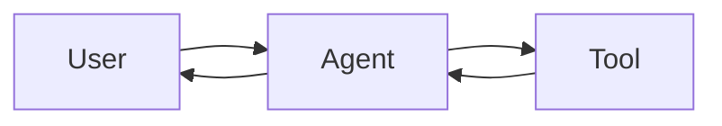
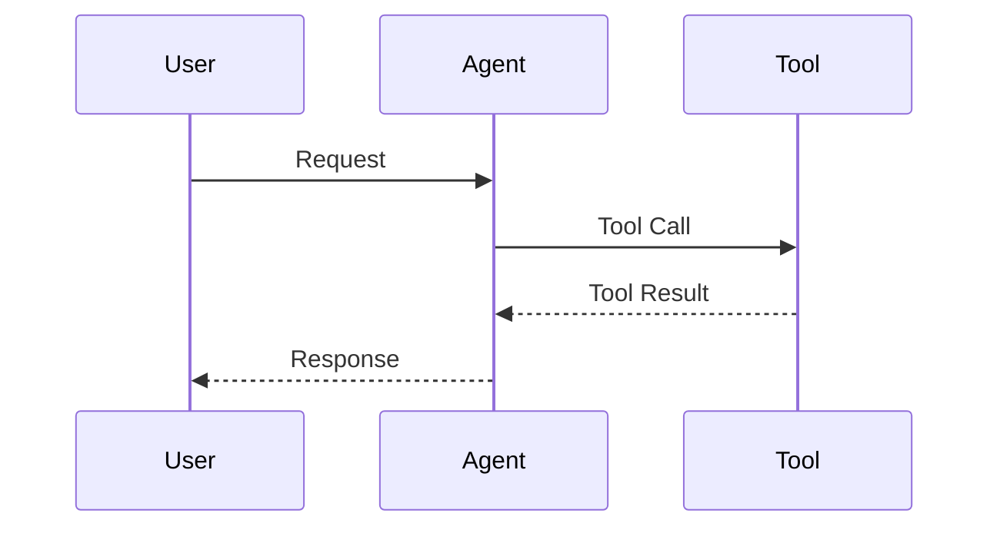

# Technical Diagram Guide

## Purpose

Define how diagrams, architecture figures, text diagrams, flowcharts, state diagrams, sequence diagrams, and technical visualizations should be created and reviewed in technical writing.

This guide focuses on:

- diagram type selection
- notation correctness
- tool selection
- visual complexity
- semantic clarity
- portability
- maintainability
- publication quality

The goal is not to make every article visually elaborate.

The goal is to choose the simplest representation that communicates the technical structure accurately.

---

# 1. Core Principle

Diagram complexity should increase only when information complexity requires it.

Use the simplest representation that remains:

- technically correct
- readable
- maintainable
- portable
- appropriate for the publishing medium

A useful escalation path is:

> Unicode text diagram → Mermaid → draw.io → Figma

This is a default progression, not a mandatory sequence.

Skip directly to a more appropriate tool when the task clearly requires it.

Examples:

- formula → LaTeX
- benchmark result → plotting tool
- complex architecture → draw.io
- UI design → Figma
- presentation animation → PowerPoint

---

# 2. Diagram Type Taxonomy

Do not call all text diagrams “ASCII diagrams”.

There are at least two distinct categories.

## 2.1 ASCII Diagram

An ASCII diagram uses ASCII characters only.

Typical characters include:

```text
+ - | > < ^ v / \
```

Example:

```text
+--------+     +--------+
| Client | --> | Server |
+--------+     +--------+
```

Use ASCII diagrams when:

- the environment is strictly ASCII-only
- terminal compatibility is the primary concern
- Unicode rendering cannot be trusted
- the diagram is extremely simple

---

## 2.2 Unicode Text Diagram

A Unicode text diagram uses Unicode box-drawing and arrow characters.

Typical characters include:

```text
┌ ─ ┐
│   │
└ ─ ┘
→ ← ↑ ↓
├ ┤ ┬ ┴ ┼
```

Example:

```text
┌────────┐      ┌────────┐
│ Client │ ───→ │ Server │
└────────┘      └────────┘
```

Do not call this an ASCII diagram.

Use the term:

> Unicode text diagram

or:

> Unicode box-drawing diagram

---

# 3. ASCII vs Unicode

Prefer Unicode text diagrams over ASCII when:

- Unicode is supported
- the diagram is small
- visual clarity matters
- box boundaries are useful

Prefer ASCII when:

- compatibility is more important than appearance
- content may be rendered in restricted terminals
- Unicode width behavior is unreliable

Do not convert ASCII into Unicode merely for decoration if compatibility is the main requirement.

---

# 4. Text Diagram Use Cases

Text diagrams are best for small local explanations.

Good use cases include:

- pointer/reference relationships
- object sharing
- shallow vs deep copy
- small memory layouts
- linked-list structure
- stack/queue state
- binary-tree fragments
- simple request flow
- small state transitions
- local component relationships

Example:

```text
a ──┐
    ▼
┌───────────┐
│   list    │
│  ┌─────┐  │
│  │ ref │──┼────→ inner list
│  └─────┘  │
└───────────┘
```

Do not use a large text diagram merely because it can technically be drawn.

---

# 5. Text Diagram Alignment Risks

Text diagrams depend heavily on character width.

Potential sources of alignment failure include:

- proportional fonts
- Chinese characters
- emoji
- tabs
- combining characters
- ambiguous-width Unicode
- mixed ASCII and Unicode symbols
- browser font fallback
- copy-paste into another platform

Always place text diagrams inside a fenced `text` block.

Example:

```text
A ───→ B
      │
      ▼
      C
```

Do not rely on spaces outside a code block for precise alignment.

---

# 6. Chinese Text in Text Diagrams

Use Chinese text inside alignment-sensitive diagrams cautiously.

Chinese characters are commonly rendered as double-width in monospaced environments, but this is not guaranteed across every platform.

Example:

```text
┌──────────┐
│ 用户请求 │
└────┬─────┘
     │
     ▼
┌──────────┐
│  Agent   │
└──────────┘
```

If the diagram becomes difficult to align because of mixed Chinese and English labels, consider:

- using shorter labels
- using English-only node labels
- moving explanations outside the diagram
- switching to Mermaid
- switching to draw.io

Do not spend excessive time manually adjusting spaces in a fragile text diagram.

---

# 7. Avoid Emoji in Alignment-Sensitive Diagrams

Emoji width is highly renderer-dependent.

Avoid diagrams such as:

```text
🤖 Agent ───→ 🔧 Tool
```

when precise alignment matters.

Emoji may be acceptable in informal illustrations where alignment is not important.

For rigorous technical diagrams, prefer plain labels and standard symbols.

---

# 8. Tabs

Do not use tabs for alignment in text diagrams.

Use spaces.

Tab width differs across editors and rendering environments.

A diagram that aligns with a tab width of 4 may break under a tab width of 8.

---

# 9. Mixed ASCII and Unicode

Avoid unnecessary mixtures such as:

```text
+────────+
| Agent  |
+────────+
```

Prefer either a consistent ASCII style:

```text
+--------+
| Agent  |
+--------+
```

or a consistent Unicode style:

```text
┌────────┐
│ Agent  │
└────────┘
```

Mixing styles can produce uneven visual weight and alignment.

---

# 10. When to Stop Using Text Diagrams

Escalate from a text diagram when any of the following occurs:

- alignment requires repeated manual adjustment
- the diagram has many crossing edges
- more than a few subsystems need grouping
- nested containers dominate the diagram
- multiple arrow types require a legend
- labels become long
- the diagram is central to the article
- readers need to zoom
- layout itself carries meaning
- the diagram must be reused in slides or papers
- export quality matters

Do not preserve a text diagram merely because it was the first version.

---

# 11. Mermaid

Mermaid is appropriate when structure can be represented declaratively.

Good use cases include:

- flowcharts
- state transitions
- sequence diagrams
- simple architecture diagrams
- dependency graphs
- pipelines
- simple entity relationships
- Git-like branching diagrams
- basic timelines

Mermaid is especially useful when:

- Markdown source should remain version-controlled
- diagram source should be text-based
- layout precision is not critical
- the publishing platform supports Mermaid

---

# 12. Mermaid Example

Example:



Prefer semantic labels over decorative labels.

Avoid adding shapes, styles, or icons that do not improve meaning.

---

# 13. Mermaid Advantages

Mermaid provides several engineering advantages:

- text-based source
- easy diffing
- Git-friendly
- quick editing
- consistent layout
- no manual edge alignment
- easy regeneration
- suitable for Markdown-centric workflows

Use these strengths rather than forcing Mermaid to behave like a free-form drawing tool.

---

# 14. Mermaid Limitations

Mermaid becomes less suitable when:

- exact layout is important
- many edges cross
- multiple nested subsystems exist
- nodes require precise positioning
- the figure needs custom visual hierarchy
- publication-quality composition matters
- labels are long
- the diagram contains many annotations
- the renderer produces unstable layouts
- the diagram requires extensive styling hacks

Do not spend excessive time fighting Mermaid's automatic layout.

---

# 15. Mermaid Complexity Threshold

There is no universal node-count limit.

As a practical soft threshold, reconsider Mermaid when the diagram reaches roughly:

> 10–15 meaningful nodes

especially if it also contains:

- many crossing edges
- several nested groups
- bidirectional relationships
- long labels
- multiple edge semantics

This is not a strict rule.

A 20-node linear pipeline may still work well.

An 8-node highly connected architecture may already be too complex.

Evaluate structural complexity, not only node count.

---

# 16. Mermaid Upgrade Rule

Escalate from Mermaid to draw.io when you begin adding substantial layout hacks merely to force the desired structure.

Warning signs include:

- invisible links used only for positioning
- excessive subgraphs used only for alignment
- repeated renderer-specific workarounds
- duplicated nodes to avoid crossings
- unnatural graph direction choices
- excessive styling directives
- a large amount of diagram code unrelated to semantics

At that point, a graphical editor is usually more maintainable.

---

# 17. Mermaid Flow Direction

Choose flow direction according to the conceptual structure.

Common directions:

```text
LR
```

for pipelines and request flows.

```text
TD
```

for hierarchical systems and decision processes.

Do not choose direction only because it looks visually wider or taller.

The direction should support how readers mentally traverse the process.

---

# 18. Mermaid Sequence Diagrams

Use sequence diagrams when temporal ordering and interaction among actors matter.

Example:



Use sequence diagrams for:

- request-response chains
- API interactions
- Agent-tool loops
- distributed-service interactions
- asynchronous workflows

Do not use a flowchart when the central question is:

> Who sends what to whom, and in what order?

---

# 19. State Diagrams

Use state diagrams when the main information is state transition.

Example:

```text
PENDING → RUNNING → SUCCESS
              │
              └────→ FAILED
```

For more complex state machines, Mermaid may be preferable.

Each state should represent a meaningful system condition.

Each transition should represent an event or condition.

Do not use states merely as visual boxes for arbitrary steps.

---

# 20. Flowcharts

Use flowcharts when:

- branching logic matters
- decisions matter
- execution order matters

Typical elements include:

- input
- process
- decision
- output
- termination

Avoid flowcharts that merely convert every sentence of prose into a box.

A flowchart should expose structure that is difficult to understand from prose alone.

---

# 21. Architecture Diagrams

Architecture diagrams should communicate system boundaries and relationships.

Typical information includes:

- major components
- external systems
- data flow
- control flow
- persistence
- communication boundaries
- execution boundaries

Do not overload one architecture diagram with every class, function, table, protocol, and deployment detail.

Use multiple diagrams at different abstraction levels when necessary.

---

# 22. Architecture Abstraction Levels

A complex system may require several views.

For example:

## System Context

Show:

- users
- external services
- the system as one boundary

## Container or Service Level

Show:

- services
- databases
- queues
- external APIs

## Component Level

Show:

- major runtime modules
- Agent Loop
- Tool Registry
- Memory Manager
- Context Manager

## Execution Flow

Show:

- request lifecycle
- tool execution
- retry
- recovery

Do not force all levels into one figure.

---

# 23. Draw.io

Use draw.io when the diagram requires:

- precise layout
- nested system boundaries
- many components
- many annotations
- controlled edge routing
- formal architecture presentation
- reusable vector export
- stable manual composition

Typical use cases:

- system architecture
- deployment topology
- database architecture
- complex Agent runtime
- network topology
- distributed workflow
- infrastructure diagrams

---

# 24. Draw.io Source Files

When draw.io is used, preserve the editable source.

Prefer storing:

```text
architecture.drawio
```

alongside exported assets.

Do not keep only a PNG if the diagram is likely to be revised.

Editable source improves:

- maintainability
- collaboration
- version history
- future export

---

# 25. Draw.io Export Format

Prefer vector export when supported.

Recommended:

```text
SVG
```

for technical blogs and documentation when the platform supports it.

Advantages include:

- scalability
- sharp text
- smaller size for many diagrams
- easier high-DPI rendering

Use PNG when:

- the platform does not support SVG
- compatibility is more important
- the diagram contains effects that do not export reliably

Avoid JPEG for diagrams with text and sharp lines unless required.

---

# 26. PowerPoint

PowerPoint is presentation-first.

Use it when:

- the diagram will be presented live
- progressive disclosure matters
- animation matters
- the presenter needs to reveal layers step by step
- the same content is part of a defense, interview, lecture, or talk

PowerPoint is especially useful for:

- animated architecture explanations
- progressive request-flow demonstrations
- interview presentations
- technical teaching videos

Do not use PowerPoint as the default source format for static blog architecture diagrams.

---

# 27. Figma

Use Figma when visual design itself is important.

Good use cases include:

- UI/UX diagrams
- polished project websites
- portfolio graphics
- product diagrams
- promotional technical visuals
- visually branded system illustrations
- diagrams requiring custom typography or component systems

Do not choose Figma simply because it appears more professional.

For many technical architecture diagrams, draw.io is faster and more maintainable.

---

# 28. LaTeX and Mathematical Figures

Use LaTeX for mathematical relationships and notation.

Do not draw a diagram if a formula communicates the relationship more precisely.

Example:

```latex
f : X \to Y
```

is preferable to drawing two boxes and an arrow when the only purpose is to express a mathematical mapping.

For advanced academic figures, TikZ may be appropriate when:

- the document is already LaTeX-based
- exact mathematical typography matters
- reproducible vector output is important

Do not introduce TikZ into a Markdown workflow unless its benefits justify the complexity.

---

# 29. Data Visualization

Use a plotting tool rather than a general diagram tool for quantitative data.

Appropriate tools include:

- Matplotlib
- Plotly
- Vega-Lite
- spreadsheet charting
- statistical visualization libraries

Use plots for:

- trends
- distributions
- comparisons
- correlations
- benchmark results
- training curves
- latency
- throughput
- memory usage

Do not manually draw bar charts in draw.io or Unicode text unless the values are extremely simple and the context explicitly calls for text-only output.

---

# 30. Choose the Right Chart

Use chart type according to the question.

Examples:

- comparison across categories → bar chart
- trend over time → line chart
- distribution → histogram or box plot
- relationship between variables → scatter plot
- cumulative behavior → cumulative curve
- latency percentiles → percentile plot or table where clearer

Do not choose a chart merely because it is visually attractive.

---

# 31. Avoid Decorative Data Visualization

Do not use:

- 3D bar charts
- unnecessary gradients
- decorative shadows
- unrelated icons
- excessive colors
- perspective distortion

when they reduce quantitative readability.

Data visualization should prioritize accurate comparison.

---

# 32. Academic Figures

Core academic figures should usually be:

- vector-based where practical
- scalable
- readable when printed
- legible in grayscale
- consistent in typography
- consistent in line weight
- sufficiently high contrast
- referenced by number
- accompanied by an informative caption

Avoid using fragile text diagrams as central paper figures.

---

# 33. Figure Caption

A caption should explain what the reader is looking at.

Weak:

> 图 1：架构图

Better:

> 图 1：Agent Runtime 的核心组件及 Tool Call 数据流

A good caption may communicate:

- what the figure shows
- the scope
- important encoding
- experimental conditions where relevant

Do not make the caption a duplicate of the entire surrounding paragraph.

---

# 34. Figure Numbering

For formal technical documents, number important figures consistently.

Example:

```text
图 1
图 2
图 3
```

or:

```text
Figure 1
Figure 2
Figure 3
```

Choose one language convention according to the article.

Do not mix:

```text
图 1
Figure 2
图三
```

without a reason.

---

# 35. Referencing Figures in Prose

Prefer explicit references:

> 如图 2 所示……

> 图 3 展示了 Tool Call 的完整生命周期。

Avoid relying only on:

> 如下图所示……

when the document contains multiple figures.

Explicit numbering improves:

- cross-reference
- editing
- discussion
- review

---

# 36. Diagram Semantics

Every visual element should have a reason to exist.

Ask:

- What does this node represent?
- What does this edge represent?
- What does edge direction mean?
- What does containment mean?
- Does color encode information?
- Does line style encode information?
- Are similar shapes semantically equivalent?

Do not use visual distinctions that have no semantic meaning.

---

# 37. Arrow Semantics

Arrows are among the most common sources of ambiguity.

An arrow might mean:

- data flow
- control flow
- dependency
- invocation
- ownership
- transition
- inheritance
- network communication
- temporal ordering
- transformation

If several meanings exist in one figure, distinguish them clearly.

Possible methods include:

- labels
- different line styles
- legend
- separate diagrams

Do not assume readers know what every arrow means.

---

# 38. Arrow Direction

Arrow direction must be consistent with the represented relation.

Examples:

```text
User → Agent
```

means something different from:

```text
Agent → User
```

For bidirectional communication, use either:

```text
A ↔ B
```

or two directional edges when direction-specific semantics matter.

Do not use bidirectional arrows merely to reduce edge count.

---

# 39. Label Important Edges

Label edges when the relationship itself matters.

Example:

```text
Agent ──Tool Call──→ Executor
Executor ──Tool Result──→ Agent
```

This is often clearer than:

```text
Agent ───→ Executor
Executor ───→ Agent
```

Do not label every obvious edge if labels create clutter.

---

# 40. Node Naming

Use short, stable, semantically meaningful node names.

Prefer:

```text
Tool Registry
```

over:

```text
The module responsible for storing and finding all available tools
```

Long explanations belong in prose or annotations.

Use the same component name in:

- prose
- code
- architecture diagrams
- tables

when they refer to the same thing.

---

# 41. Consistent Abstraction Level

Nodes within the same region should usually operate at comparable abstraction levels.

Potentially confusing:

```text
Frontend
Agent Runtime
MySQL users table
retry()
```

These represent:

- application layer
- subsystem
- specific table
- function

Do not mix levels arbitrarily unless the purpose of the diagram explicitly requires it.

---

# 42. Grouping and Boundaries

Use boundaries to communicate:

- process boundaries
- machine boundaries
- service boundaries
- trust boundaries
- network boundaries
- subsystem ownership

Do not use boxes merely to create visual decoration.

If a boundary has meaning, label it.

Example:

```text
┌─────────────────────────────┐
│ Agent Runtime               │
│                             │
│ Planner → Executor → Tools  │
└─────────────────────────────┘
```

---

# 43. Trust Boundaries

For security-related diagrams, explicitly show trust boundaries when they matter.

Examples:

- browser vs backend
- internal service vs external API
- trusted runtime vs sandbox
- user-controlled input vs validated input

Do not infer “secure” merely from component separation.

The diagram should reflect the actual trust model.

---

# 44. Deployment Boundaries

For deployment diagrams, distinguish:

- process
- container
- VM
- physical machine
- network
- region
- cluster

Do not use the same box style for all levels if doing so creates ambiguity.

Label deployment units explicitly.

---

# 45. Data Flow vs Control Flow

Do not mix data flow and control flow without distinction when both matter.

Example:

```text
User Request ───→ Agent
                     │
                     │ Tool Call
                     ▼
                    Tool
```

If one edge represents data and another represents control, label them or separate views.

---

# 46. Synchronous vs Asynchronous Interaction

When timing semantics matter, distinguish:

- synchronous call
- asynchronous event
- queue-based delivery
- streaming
- callback

A simple arrow may hide important system behavior.

Use labels such as:

```text
HTTP request
event
SSE stream
message queue
callback
```

where necessary.

---

# 47. Storage

Represent storage components consistently.

Examples include:

- database
- object storage
- vector database
- cache
- filesystem
- message log

Do not draw all persistence systems as generic service boxes if storage semantics matter.

However, do not overuse traditional database cylinder shapes if they add no useful information.

Semantic clarity matters more than icon convention.

---

# 48. External Systems

Clearly distinguish external systems from internal components.

Possible techniques include:

- outer system boundary
- label `External`
- separate region
- different container

Readers should be able to identify what is controlled by the system being described.

---

# 49. Legends

Add a legend only when visual encoding requires one.

A legend is useful when:

- colors have meanings
- line styles differ
- node shapes encode categories
- multiple arrow semantics exist

Do not add a legend for obvious labels.

If a diagram requires a large legend to be understandable, reconsider whether too much information is being encoded at once.

---

# 50. Color

Color should encode information or improve hierarchy.

Possible uses:

- subsystem category
- execution status
- ownership
- risk
- baseline vs proposed method

Do not rely on color alone for critical distinctions.

Consider:

- grayscale printing
- color blindness
- dark mode
- projector quality

Combine color with labels, shapes, or line styles when the distinction matters.

---

# 51. Dark and Light Backgrounds

Technical diagrams may appear under:

- light theme
- dark theme
- printed white paper
- embedded presentation backgrounds

Avoid relying on transparent colors or extremely light strokes that disappear under theme changes.

When publishing SVG, verify how text and lines behave under the target platform.

---

# 52. Typography

Use readable labels.

Avoid:

- very small text
- excessive font variation
- decorative fonts
- inconsistent capitalization
- long paragraphs inside nodes

Typography should support the diagram, not compete with it.

---

# 53. Text Size

A diagram that is readable only when zoomed to 300% is usually too dense.

For central technical figures, verify readability at the size at which readers will actually encounter the figure.

If labels become too small:

- reduce information
- split the figure
- shorten labels
- increase canvas size
- move detail into prose

---

# 54. Edge Crossings

Minimize edge crossings.

Crossings increase cognitive load and can make connectivity ambiguous.

If many crossings remain:

- reorder nodes
- change orientation
- group components
- split the diagram
- use another view
- switch from Mermaid to draw.io

Do not solve crossings by adding arbitrary curves that make paths harder to follow.

---

# 55. Crossing vs Junction

Make it clear whether two lines:

- cross without connection
- join at a junction

This is especially important in network and circuit-like diagrams.

Do not let readers infer connectivity from ambiguous intersections.

---

# 56. Diagram Density

A useful warning sign is when the reader must repeatedly move their eyes across the entire figure to follow one relationship.

Dense diagrams can often be improved through:

- grouping
- numbered steps
- multiple views
- hierarchical decomposition
- removing secondary information

Do not equate density with technical depth.

---

# 57. One Diagram, One Main Question

Each diagram should answer a primary question.

Examples:

- What components exist?
- How does a request flow?
- How does state change?
- Who communicates with whom?
- How is data stored?
- How do two algorithms differ?
- How are objects shared?

If one figure tries to answer all of these, split it.

---

# 58. Architecture vs Execution Flow

Architecture and execution flow are related but distinct.

Architecture asks:

> What components exist and how are they connected?

Execution flow asks:

> What happens during one request or task?

Do not force runtime chronology into a static architecture figure when a sequence or flow diagram would be clearer.

---

# 59. Static Structure vs Dynamic Behavior

Static structure includes:

- components
- ownership
- dependency
- hierarchy
- storage

Dynamic behavior includes:

- requests
- messages
- state changes
- retries
- failures
- timing

Use different diagrams when necessary.

---

# 60. Happy Path vs Failure Path

Do not overload the primary diagram with every failure path.

A good pattern is:

> Figure 1: normal execution

> Figure 2: failure and recovery

This often communicates more clearly than a single diagram containing dozens of retry and fallback edges.

---

# 61. Progressive Explanation

For complex architecture, present diagrams progressively.

Example sequence:

1. system boundary
2. core components
3. request flow
4. tool execution
5. failure recovery
6. persistence

This is especially effective for:

- teaching
- interview explanations
- presentations
- technical videos

Do not reveal all implementation details before readers understand the top-level structure.

---

# 62. Before-and-After Diagrams

Use before-and-after views when explaining:

- refactoring
- optimization
- architecture migration
- bug fixes
- memory-sharing changes
- deployment changes

Keep shared elements visually stable between versions.

This makes the changed relationship easier to inspect.

---

# 63. Comparison Diagrams

When comparing two designs:

- use the same abstraction level
- use the same terminology
- use similar layout where possible
- highlight only meaningful differences

Do not make one option visually complex and the other visually simple in a way that biases interpretation.

---

# 64. Object and Reference Diagrams

For programming-language explanations, distinguish:

- variable/name
- container
- object
- reference
- copied object
- shared object

Example:

```text
a ─────┐
       ▼
   ┌────────┐
   │ outer  │
   │  list  │
   └───┬────┘
       │
       ▼
   ┌────────┐
   │ inner  │
   │  list  │
   └────────┘

b ─────┘
```

If `a` and `b` point to the same object, make that relation explicit.

Do not draw a variable as though it physically contains the object when the teaching point is reference semantics.

---

# 65. Shallow Copy Diagram

For shallow copy, show:

- different outer containers
- shared nested objects

Example:

```text
a ──→ ┌──────────┐
      │ outer A  │
      │    │     │
      └────┼─────┘
           │
           ▼
      ┌──────────┐
      │  inner   │
      └──────────┘
           ▲
           │
      ┌────┼─────┐
      │ outer B  │
      └──────────┘
           ▲
           │
           b
```

The diagram should make clear that the outer containers differ while the inner object is shared.

---

# 66. Deep Copy Diagram

For deep copy, show distinct copied mutable objects.

Example:

```text
a ──→ ┌──────────┐
      │ outer A  │
      └────┬─────┘
           │
           ▼
      ┌──────────┐
      │ inner A  │
      └──────────┘

b ──→ ┌──────────┐
      │ outer B  │
      └────┬─────┘
           │
           ▼
      ┌──────────┐
      │ inner B  │
      └──────────┘
```

Do not imply that every immutable object must also be physically duplicated.

The diagram should represent the semantic relationship relevant to the explanation.

---

# 67. Trees and Graphs

Text diagrams work well for small trees.

Example:

```text
        4
      /   \
     2     6
    / \   / \
   1   3 5   7
```

For larger graphs or graphs with many cross edges, use Mermaid, Graphviz, or a graphical editor.

Do not use manual text spacing for a graph that will frequently change.

---

# 68. Graphviz

Graphviz may be useful when:

- graph structure is generated programmatically
- automatic layout is desirable
- dependency or graph visualization is the main task
- Markdown integration is not the primary constraint

Graphviz is often a better fit than draw.io for automatically generated graph structures.

Do not add Graphviz to a workflow when Mermaid already handles the problem adequately.

---

# 69. UML

Use UML notation only when UML semantics add value.

Possible diagrams include:

- class diagrams
- sequence diagrams
- state diagrams
- activity diagrams

Do not add UML symbols merely to make a diagram look formal.

If readers are not expected to know UML, prefer clear labels over unexplained notation.

---

# 70. Class Diagrams

Use a class diagram when relationships such as:

- inheritance
- composition
- aggregation
- association

are central to the explanation.

Do not represent a runtime service architecture as a class diagram unless classes are genuinely the relevant abstraction.

---

# 71. Sequence Diagram Semantics

Sequence diagrams should preserve temporal order.

The vertical axis represents progression over time.

Messages should have:

- sender
- receiver
- direction
- meaningful label

Avoid sequence diagrams whose message ordering does not matter.

In that case, a component or flow diagram may be simpler.

---

# 72. State Transition Semantics

For state machines, identify:

- valid states
- transitions
- trigger/event
- guards where relevant
- terminal states

Avoid impossible transitions unless they are explicitly shown as invalid.

When failure paths matter, include them or describe them in prose.

---

# 73. Database Diagrams

Use ER diagrams when the core question is data relationships.

Use architecture diagrams when the core question is database placement and service interaction.

Do not mix logical schema and deployment topology into one unreadable figure unless necessary.

---

# 74. Network Diagrams

For network diagrams, distinguish relevant layers.

Possible elements include:

- host
- subnet
- router
- NAT
- firewall
- VPN
- tunnel
- service endpoint
- protocol

Do not draw physical-like network topology when the article only needs a logical request path.

---

# 75. Protocol Diagrams

Use sequence diagrams for protocol handshakes when ordering matters.

Example topics:

- TCP handshake
- TLS handshake
- OAuth flow
- authentication flow

Use labels for messages rather than relying only on arrows.

---

# 76. Agent Architecture Diagrams

For AI Agent systems, distinguish operational components.

Possible nodes include:

- User
- Agent Loop
- LLM
- Planner
- Executor
- Replanner
- Tool Registry
- Tool Runtime
- Memory
- Context Manager
- Retriever
- External Tools

Do not draw “Agent” as a single magical box if the purpose of the article is to explain how the Agent actually works.

---

# 77. Agent Loop Diagrams

A useful Agent Loop diagram may show:

```text
User
  │
  ▼
Agent Loop
  │
  ▼
LLM
  │
  ├── final answer ──→ User
  │
  └── tool call
          │
          ▼
       Tool Runtime
          │
          ▼
      Tool Result
          │
          └──────────→ next LLM turn
```

Keep model reasoning, runtime execution, and external tool behavior conceptually separate.

---

# 78. RAG Diagrams

A RAG diagram may separate:

## Offline Path

```text
Documents
   ↓
Chunking
   ↓
Embedding / Indexing
   ↓
Index
```

## Online Path

```text
Query
  ↓
Retriever
  ↓
Reranker
  ↓
Context Builder
  ↓
LLM
```

Do not collapse ingestion and online retrieval into one undifferentiated arrow if their distinction matters.

---

# 79. Training Pipeline Diagrams

For machine learning, distinguish:

- preprocessing
- training
- validation
- checkpointing
- evaluation
- inference

Do not imply that test data participates in training if it does not.

Visual separation can help prevent methodological ambiguity.

---

# 80. Diagram Source and Repository Organization

For project documentation, consider storing diagram sources separately from exported assets.

Example:

```text
docs/
├── diagrams/
│   ├── agent-runtime.drawio
│   └── rag-pipeline.mmd
└── images/
    ├── agent-runtime.svg
    └── rag-pipeline.svg
```

The exact structure is project-specific.

The important rule is:

> Preserve editable source when future maintenance is likely.

---

# 81. Version Control

Prefer text-based diagram sources when they adequately solve the problem because they produce more meaningful Git diffs.

Examples:

- Mermaid
- Graphviz
- PlantUML
- TikZ

Binary or structured graphical sources such as draw.io are still appropriate when layout control matters more than textual diff quality.

Do not choose a weaker diagram format solely for Git diffability.

---

# 82. Reproducible Diagrams

For generated plots or diagrams, preserve:

- source
- generation script
- input data where appropriate
- configuration
- tool version when rendering differences matter

Avoid manually editing a generated figure without updating its source.

---

# 83. Screenshots

Use screenshots when the actual UI or environment is the subject.

Examples:

- IDE configuration
- system settings
- application UI
- command output where visual context matters

Do not use screenshots as replacements for text when:

- the content is primarily code
- commands should be copyable
- exact text should be searchable
- the UI may change frequently

Prefer code blocks for commands and source code.

---

# 84. Annotated Screenshots

Use annotations when readers need to locate:

- a button
- a menu item
- a setting
- an error
- a specific region

Keep annotations minimal.

Avoid covering the content being explained.

---

# 85. Screenshot Freshness

UI screenshots become stale quickly.

When a tutorial depends heavily on screenshots:

- mention the relevant version when useful
- prefer conceptual instructions that survive UI changes
- avoid using screenshots for information better represented as stable text

Do not make the entire tutorial dependent on pixel-perfect UI placement unless necessary.

---

# 86. Images Generated for Decoration

Do not add decorative images to rigorous technical content unless they serve a clear communication purpose.

Decorative illustrations may be appropriate for:

- cover images
- project promotion
- social-media posts
- portfolio presentation

They should not replace architecture diagrams, plots, or precise technical explanations.

---

# 87. Accessibility

Where the publishing platform allows it:

- provide meaningful alt text
- do not encode critical information only through color
- use sufficient contrast
- use readable labels

Alt text should communicate the figure's meaning rather than merely say:

> 一张架构图

Prefer:

> Agent Runtime 架构图，展示 User 请求经过 Agent Loop 调用 LLM，并通过 Tool Runtime 执行外部工具后将结果回注模型。

---

# 88. Figure Width

Avoid exporting diagrams with enormous unused margins.

Crop or size the canvas so the main information occupies the figure effectively.

At the same time, preserve enough whitespace to separate components.

---

# 89. Aspect Ratio

Choose aspect ratio based on the publishing medium.

Wide diagrams work well for:

- desktop blogs
- slides
- architecture flows

Tall diagrams may work better for:

- mobile reading
- vertical workflows
- long state transitions

Do not force a wide 16:9 architecture figure into a narrow mobile article without checking readability.

---

# 90. Mobile Readability

For blog content likely to be read on phones:

- avoid extremely wide diagrams
- avoid tiny labels
- consider vertical layouts
- split large architecture figures
- keep textual explanations available

A technically correct figure that cannot be read on the target device is not effective communication.

---

# 91. Diagram Review Order

Review diagrams in this order:

1. Technical correctness
2. Semantic meaning
3. Missing or incorrect relationships
4. Abstraction level
5. Tool suitability
6. Layout
7. Label consistency
8. Edge crossings
9. Typography
10. Visual polish

Do not polish colors before verifying that the arrows are correct.

---

# 92. Tool Selection Protocol

Use this decision process.

## Mathematical Relation

Prefer:

> LaTeX

## Quantitative Data

Prefer:

> plotting tool

## Tiny Local Structural Explanation

Prefer:

> Unicode text diagram

Use ASCII only when compatibility requires it.

## Simple Flow, State, Sequence, or Dependency

Prefer:

> Mermaid

## Complex Formal Architecture

Prefer:

> draw.io

## Presentation with Progressive Reveal

Prefer:

> PowerPoint

## UI, Portfolio, Branding, or High Visual Customization

Prefer:

> Figma

## Automatically Generated Graph Structure

Consider:

> Graphviz

Do not mechanically follow this table when the publishing environment imposes stronger constraints.

---

# 93. Escalation Protocol

Start with the lowest-complexity tool that can express the information correctly.

A typical escalation path is:

```text
Unicode text diagram
        ↓
      Mermaid
        ↓
      draw.io
        ↓
       Figma
```

Escalate when the current tool causes:

- fragile alignment
- unreadable density
- excessive layout hacks
- poor export quality
- inadequate semantic encoding
- high maintenance cost

Do not escalate merely to make the diagram look more sophisticated.

---

# 94. Text Diagram Review Checklist

Verify:

- [ ] The diagram is correctly called ASCII or Unicode.
- [ ] The diagram is inside a `text` fence.
- [ ] Tabs are not used for alignment.
- [ ] Alignment does not depend excessively on mixed-width characters.
- [ ] Emoji are avoided when alignment matters.
- [ ] ASCII and Unicode box styles are not mixed without reason.
- [ ] Arrow direction is correct.
- [ ] Labels are short enough to remain stable.
- [ ] The diagram is small enough that text remains the right medium.

---

# 95. Mermaid Review Checklist

Verify:

- [ ] Mermaid is supported by the target platform.
- [ ] The selected diagram type matches the information.
- [ ] Flow direction matches conceptual traversal.
- [ ] Node labels are concise.
- [ ] Edge semantics are understandable.
- [ ] Layout hacks are not dominating the source.
- [ ] Node count and connectivity remain readable.
- [ ] A graphical editor would not clearly be more maintainable.

---

# 96. Architecture Diagram Review Checklist

Verify:

- [ ] System boundaries are clear.
- [ ] Internal and external systems are distinguishable.
- [ ] Components use comparable abstraction levels.
- [ ] Data flow and control flow are not ambiguously mixed.
- [ ] Storage is represented clearly.
- [ ] Important protocols or channels are labeled.
- [ ] Arrow direction is correct.
- [ ] Failure or recovery paths are represented when central to the explanation.
- [ ] The figure answers one main architectural question.
- [ ] Secondary detail has not overwhelmed the primary structure.

---

# 97. Figure Quality Checklist

Verify:

- [ ] Text is readable at normal display size.
- [ ] Lines and arrows are visually clear.
- [ ] Edge crossings are minimized.
- [ ] Visual encoding is semantically meaningful.
- [ ] Colors are not required to understand critical distinctions.
- [ ] The figure works under the target background/theme.
- [ ] The export format is suitable.
- [ ] Editable source is preserved when appropriate.
- [ ] Figure numbering is consistent.
- [ ] Caption explains the figure.
- [ ] Prose references the figure explicitly where needed.

---

# 98. Academic Figure Checklist

Verify:

- [ ] The figure can be exported as vector graphics where practical.
- [ ] Labels remain legible when printed.
- [ ] Typography is consistent.
- [ ] Grayscale rendering remains understandable.
- [ ] Axes, legends, and units are defined.
- [ ] Caption provides sufficient context.
- [ ] Figure numbering is consistent.
- [ ] Decorative elements do not obscure technical information.

---

# 99. Stop Condition

Do not keep redesigning a diagram after it is:

- technically correct
- readable
- semantically clear
- appropriate for the medium
- consistent with the article

Further visual refinement is optional unless it materially improves communication.

Do not replace a clear Unicode diagram with Figma merely because Figma can produce a more polished image.

---

# Core Principle

A technical diagram is not decoration.

It is a compressed technical argument.

Every node, edge, boundary, label, position, and visual distinction should either communicate meaning or help readers recover that meaning more quickly.

Choose the simplest medium that preserves the required semantics, and escalate only when the information demands it.